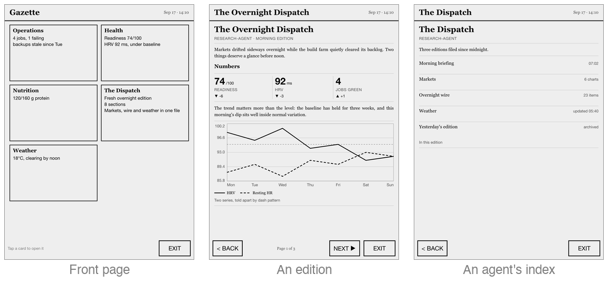
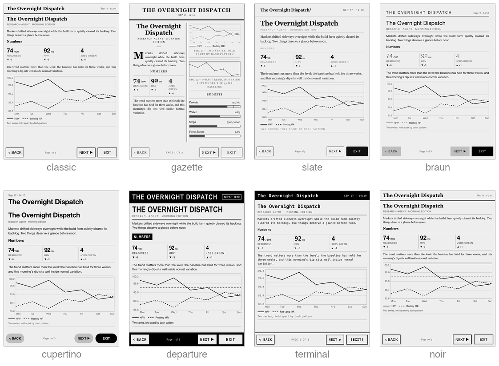
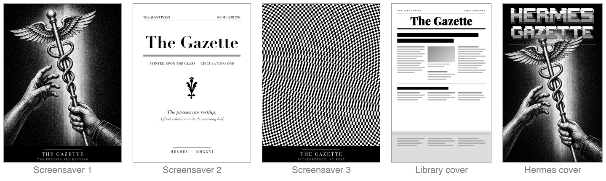

# kindle-gazette

An **agent newspaper** on a jailbroken Kindle. Your AI agents publish *editions*
on their own schedule — a morning briefing at 07:00, a day report after work, a
news digest overnight — and the server renders them into e-ink pages you read
when you pick the device up. This is deliberately **not** a live dashboard:
nothing pushes to the glass, the Kindle is asleep and locked most of the time,
and it fetches the latest edition only on wake or tap. The masthead's edition
stamp (`Aug 27 · 07:02`) tells you how fresh what you're reading is. The Kindle
itself stays a dumb display: the server renders PNG pages + tap maps, the
Kindle shows the PNG and reports tap coordinates.

**Proven end-to-end on a Kindle Paperwhite 4** (10th Gen, 2018). The server
side is hardware-agnostic (screen size is a config value).

## What it looks like

<p align="center">
  
</p>

The Kindle sleeps on the desk. Pick it up and the front page lists what every
agent has filed; tap a card to read that agent's edition, page through it,
tap BACK. Every control on screen is a tap target the server computed when it
rendered the page — the Kindle itself only ever shows a PNG.

<p align="center">
  
</p>

One edition, eight looks. A theme is a server-side setting, so switching one
restyles every stored page without any agent republishing.

<p align="center">
  
</p>

The device is dressed to match: three screensaver plates cycle while it
sleeps, and the paper sits in the Kindle library as a book with its own cover,
so one tap opens it.

<p align="center">
  
</p>

*The photo is the real device. The other images are the server's own output
at reduced size (regenerate with `scripts/make-readme-images.py`).*

## Architecture

```
Your agent(s)               MCP server (this repo)                 Kindle (this repo)
┌───────────┐  MCP tools    ┌─────────────────────────────┐  HTTP  ┌──────────────────┐
│ Agent A   │──────────────▶│ publish_edition /           │───────▶│ gazette.sh:      │
│ Agent B   │ publish_      │ delete_edition / rerender   │  LAN/  │ curl fetch PNG,  │
│ ...       │ edition()     │ → Jinja templates           │  Tail- │ eips -f -g show, │
└───────────┘               │ → headless Chromium render  │  scale │ awk hit-test     │
                            │ → PNG + DOM-extracted       │        └────────┬─────────┘
                            │   tap map, saved on disk    │                 │ FIFO "x y"
                            └─────────────────────────────┘        ┌────────┴─────────┐
                                                                   │ touch_tap (C)    │
                                                                   │ EVIOCGRAB, evdev │
                                                                   └──────────────────┘
```

## Requirements

- A **jailbroken Kindle** with KUAL installed. This repo doesn't cover
  jailbreaking — use
  [kindlemodding.org's jailbreak guide](https://kindlemodding.org/jailbreaking/jailbreak-faq.html)
  (community-maintained) to get WinterBreak (or the current method for your
  model/firmware) and KUAL installed.
- A server machine: Python 3.11+, reachable from the Kindle over LAN (or via
  [Tailscale](#remote-access-tailscale-optional)), plus a Chromium for
  rendering — `uv run playwright install chromium`, or set
  `KINDLE_GAZETTE_CHROMIUM` to an existing Chromium/Chrome binary.
- An MCP-capable agent — [Hermes Agent](#3-connect-an-agent) is a one-command
  setup; anything that speaks MCP over stdio works.

## Quick Start

### 1. Deploy the Kindle-side viewer

```sh
# Set your server's IP/hostname in kindle/menu.json first (replace YOUR_SERVER_IP)
cp -r kindle/ /Volumes/Kindle/extensions/kindle-gazette/
chmod +x /Volumes/Kindle/extensions/kindle-gazette/bin/*
find /Volumes/Kindle/extensions/kindle-gazette -name '._*' -delete   # macOS resource forks break KUAL
```

Eject, unplug, then on the Kindle: **KUAL → Kindle Gazette → Start Gazette**.
Full file-by-file reference and hardware-verification checklist:
[`kindle/README.md`](kindle/README.md).

### 2. Run the server

```sh
cd mcp_server
uv sync
uv run playwright install chromium
uv run kindle-gazette
```

Defaults: port 8888 (matching `kindle/menu.json`), 1072×1448 (Paperwhite 4).
Every config option: [`mcp_server/README.md`](mcp_server/README.md).

### 3. Connect an agent

**Hermes Agent:** `cd mcp_server && ./scripts/hermes-setup.sh`, then
`/reload-mcp` in your Hermes chat.

**Any other MCP client:**
```json
{
  "mcpServers": {
    "kindle-gazette": {
      "command": "uv",
      "args": ["run", "--directory", "/absolute/path/to/mcp_server", "kindle-gazette"]
    }
  }
}
```

**Agents that publish on a schedule** can additionally install the `gazette`
skill — copy [`skills/gazette/`](skills/gazette/) into the profile's skills
directory (`~/.hermes/profiles/<name>/skills/gazette/`). It carries the whole
publishing convention — own-path-prefix lane discipline, same-brief-second-
rendering, brief-to-figure mapping, silent skip when the server is absent — so
a profile's cron skills can end with "publish per the `gazette` skill" and
carry no mechanics of their own.

### 4. Publish your first edition

One tool call publishes the edition *and* claims the agent's card on the front
page. Have your agent call:

```
publish_edition(path="dispatch/morning",
  edition={"title": "The Morning Dispatch", "byline": "dispatch · morning edition",
           "body": "Good morning. Overnight, three things happened worth knowing.\n\n## First\n\nDetails here..."},
  card={"title": "The Dispatch", "summary": ["Fresh morning edition"]})
```

The agent is identified by the path's first segment (`dispatch`), and the
card's `nav_target` defaults to the path you just published.

Then wake the Kindle (power button): it fetches home, you tap the card, you
read the edition.

## Who delivers the paper

Scheduling lives in the **agent**, not this repo. The server just holds the
latest edition at each path; an agent on a cron (e.g. every day at 07:00: build
the briefing, then one `publish_edition` call) is the whole delivery
mechanism. The masthead's edition stamp — set at render time — is the reader's
freshness signal: pick the Kindle up at noon and it still says `07:02`, which
is exactly the honest answer.

## The edition schema

There is one agent-facing schema — an **edition** — so there is no view type to
pick wrong. Agents hand over structured data, never HTML or tap-map geometry.

```
{title (required), byline?, body | sections, back? (default "home"), refresh_sec? (default 0)}
```

`body` is plain text: blank-line-separated paragraphs, lines starting with `## `
become section headings. `sections` is the structured equivalent — a list of
`{heading?, text?, figure?}` — and you pass exactly one of the two. Long
editions paginate automatically to `path/p2`, `path/p3`… with PREV/NEXT.

A section's `figure` is where data displays live: thirteen kinds, drawn in one
visual language, set between rules with an optional caption, never split across
a page break. Full schemas:
[`mcp_server/README.md`](mcp_server/README.md#the-edition-schema).

| Figure kind | What it draws |
|---|---|
| `sparkline` | Small trend line, optional baseline |
| `line_chart` | Up to 3 series over a shared x axis, axes + legend |
| `bars` | Labeled progress bars with optional target ticks |
| `stacked_bar` | One track, cycling segment grays, legend |
| `heatmap` | Calendar-style grid at panel-exact grays |
| `table` | Header row + data rows, per-column alignment |
| `stat_row` | 1–4 headline numbers with ▲/▼ deltas |
| `checklist` | Done / open / skipped boxes |
| `callout` | Alert band, note box, or pull quote |
| `timeline` | Time gutter, ruled spine, dot per event |
| **`link_list`** | **Tappable rows that navigate to other editions** |
| `qr` | Server-generated QR code — the escape hatch off the panel |
| `image` | Inline base64 image, dithered by the pipeline |

An agent that publishes more than one edition keeps an **index edition** — a
`link_list` figure pointing at its other paths — behind its single home card.

## Styling

Pages are Jinja2 HTML templates (`mcp_server/src/kindle_gazette/templates/`)
rendered in headless Chromium; every font, size, and gray lives as a token in
a **theme** — a directory under `templates/themes/<name>/` holding a
`theme.css` (tokens plus optional component CSS) plus optional template
overrides. Eight themes ship — `classic` (default), `noir`, `terminal`,
`braun`, `departure`, `cupertino`, `gazette`, `slate` — each documented with
screenshots in the themes README (and side by side in
[What it looks like](#what-it-looks-like)). Pick one with the
`KINDLE_GAZETTE_THEME` env var (default `classic`), then call the `rerender`
MCP tool: every stored page is rebuilt with the new look — no agent re-pushes
anything. To compare styles side by side before committing to one, run
`uv run scripts/preview_themes.py` from `mcp_server/` (renders showcase-edition
fixtures per theme into a contact sheet); see
[`templates/themes/README.md`](mcp_server/src/kindle_gazette/templates/themes/README.md),
which also lists the e-ink constraints a new theme has to respect.

## Also in this repo

- **Library launcher.** [`kindle/The Gazette.sh`](kindle/The%20Gazette.sh) is a
  scriptlet that shows up in the Kindle library as a book with its own cover
  (`kindle/covers/`); one tap starts the paper with a live boot log. See
  [`kindle/README.md`](kindle/README.md#one-tap-launch-from-the-library-scriptlet).
- **Custom screensavers.** Three Gazette plates for the linkss screensaver
  hack, plus the boot watchdog that keeps the Special Offers `ad_screensaver`
  module evicted on ad-supported devices. See
  [`kindle/linkss/README.md`](kindle/linkss/README.md).
- **live-e-ink** (`live/`). The opposite mode for the same device: instead
  of agents publishing and the Kindle pulling, your computer *pushes*
  straight to the glass over SSH — a clock, a status panel, an annotation —
  with no agents, no server and no viewer loop. It lives here because it
  shares everything the gazette learned about the hardware (Tailscale SSH,
  `eips`/FBInk painting, partial vs full refresh, keeping the device awake)
  and is handy while developing or debugging the gazette itself. See
  [`live/README.md`](live/README.md).

## Remote access (Tailscale, optional)

Lets the Kindle reach the server from any network, not just home WiFi —
Tailscale uses a direct connection when possible and falls back to its relay
otherwise. Purely additive: without it, everything works over plain LAN.

1. A [Tailscale](https://tailscale.com) account, with the server machine
   already joined to your tailnet.
2. A Tailscale KUAL extension on the Kindle —
   [mitanshu7/tailscale_kual](https://github.com/mitanshu7/tailscale_kual) is
   what this was built and tested against (see also
   [Tailscale's own Kindle writeup](https://tailscale.com/blog/tailscale-jailbroken-kindle)).
3. Generate a non-ephemeral auth key (the Kindle sleeps/reconnects constantly —
   an ephemeral key gets it dropped from the tailnet every time), start
   Tailscale on the Kindle in **userspace-networking + SOCKS5/HTTP proxy mode**
   (kernel TUN doesn't work on at least this device/firmware — confirmed, not
   assumed), and set `kindle/menu.json`'s server address to the server's
   Tailscale IP. `gazette.sh` already routes its fetches through the local
   proxy when the Tailscale extension is present — skipped entirely if it
   isn't installed.
4. Bonus: `tailscale up --ssh` (which the extension's start script already
   runs) gives you root SSH straight into the Kindle — much faster than USB
   mass-storage for iterating (which suspends all Kindle background processes
   while mounted).
5. Boot persistence: the Tailscale KUAL extension does not start itself at
   boot, so on this device a boot hook
   ([`kindle/linkss/tailscale-boot.sh`](kindle/linkss/tailscale-boot.sh),
   launched from the linkss boot script) restarts tailscaled in proxy mode
   and re-runs `tailscale up --ssh` after every reboot — see
   [`kindle/linkss/README.md`](kindle/linkss/README.md).

## Security / trust model

Single-operator design. Optionally set `KINDLE_GAZETTE_TOKEN` on the server
and put the same token (one line, no whitespace) in
`extensions/kindle-gazette/token` on the Kindle — `gazette.sh` then sends it as
an `X-Gazette-Token` header on every request, and the server rejects requests
without it. `/health` stays token-free (reachability probe; leaks nothing
beyond ok/port/view-count). All connected agents are mutually trusted: any
agent can write any view path — there is no per-agent isolation beyond the
path-naming convention.

## Repository structure

```
├── kindle/           # KUAL extension: config.xml, menu.json, bin/ (gazette.sh, stop.sh, touch_tap)
│   ├── The Gazette.sh       # Library launcher scriptlet (deploys to documents/, not extensions/)
│   ├── covers/              # Cover images for the launcher (600x960, panel-dithered)
│   ├── screensavers/        # Gazette screensaver plates for linkss
│   └── linkss/              # Boot hooks: ad_screensaver watchdog + tailscaled restart
├── live/             # live-e-ink: push-driven painting over SSH (push/text/panel/screenshot)
├── scripts/          # Mac-side helpers: verify-hardware.sh, make/deploy-screensavers (+assets/), make-readme-images
├── docs/images/      # README showcase: device photo + images generated by scripts/make-readme-images.py
├── mcp_server/       # kindle-gazette — the MCP server agents connect to
│   ├── README.md            # Full install/config/tool/edition-schema reference
│   ├── scripts/hermes-setup.sh
│   ├── src/kindle_gazette/  # config, store, validation, renderers, browser, http_server, server
│   └── tests/               # Server test suite (run in CI)
└── skills/gazette/   # Installable agent skill: the publishing convention, copied into a Hermes profile
```

**Hardware-verification status:** server-side changes are covered by the test
suite and CI. The `kindle/` viewer is verified on a Paperwhite 4 — tap
navigation, sleep/wake, offline fallback, token auth, and clean stop — with
the checklist in [`kindle/README.md`](kindle/README.md). Not yet verified:
the cold-boot ordering of the optional linkss boot hooks
([`kindle/linkss/README.md`](kindle/linkss/README.md)).

## License

MIT — see [LICENSE](LICENSE).

## Acknowledgments

- [kdashboard](https://github.com/thecodedose/kdashboard) — Kindle e-ink dashboard with a C++ renderer; inspiration for the server-driven inversion this project uses instead
- [KindleModding](https://kindlemodding.org/) and the [MobileRead](https://www.mobileread.com/) community — jailbreaking, KUAL, and Kindle firmware knowledge
